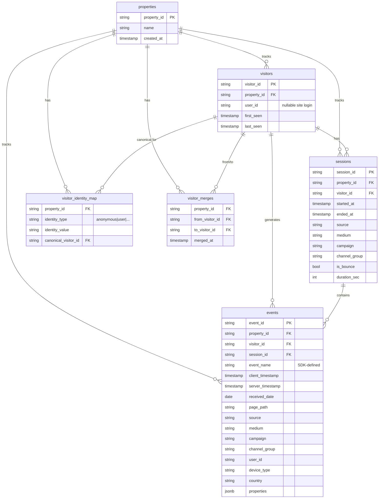

# Data model (ERD)

MVP analytics core: visitors, sessions, events, and identity. No accounts/subscriptions yet.

## Entity relationship diagram

## Relationships

| From | To | Cardinality | Meaning |
|------|-----|-------------|---------|
| visitor | session | 1:N | many visits per person |
| session | event | 1:N | many actions per visit |
| visitor | event | 1:N | all actions by that person (denormalized FK) |
| visitor | visitor_identity_map | 1:N | many raw IDs → one canonical visitor |
| visitor | visitor_merges | 1:N | merge audit trail |

## Notes

- Events are append-only; `event_name` and `properties` are defined by the SDK.
- Client sends `anonymous_id` only; server resolves `visitor_id` and assigns `session_id`.
- `visitor_identity_map` is unique on `(property_id, identity_type, identity_value)`.
- Preview this diagram at [mermaid.live](https://mermaid.live) or in GitHub Markdown.
